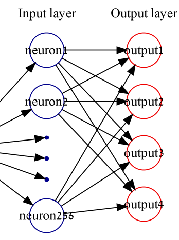
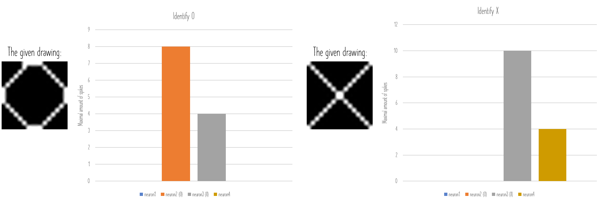

# Link for youtube video:
   https://youtu.be/ol4UJYCZ_NQ

# SNN based on lif model in erlang
This is an erlang implementation of spiking neural network. Our main traget is to develop a network that can determine between X and O.
In future work, we want to use Spike-Time Dependent Plasticity (STDP) algorithm in order to train our model to identify more items.

In this branch we will present a full distributed SNN that works with two computers:
 - One computer would be the input layer of the SNN
 - Second computer would be the output layer of the SNN
 
## Network Structure
   As said before, we used two computers one for every layer.
   
   In the first layer we have 256 neurons and in the second layer we have 4 neurons.
   
   Our work was based on given weights: https://github.com/Shikhargupta/Spiking-Neural-Network
    
  

## Image Processing
   In order to translate the image into spike train, we used receptive field that helped us to encode the image.
   
   In the folder of [Image processing](Image processing) you can see the relevant python files.
   
   
   
## Results
  After we tested our network we got results that show that we indeed identify between X/O:
   
  
  
## Instructions
  You need to open 6 different nodes that share the same cookie.
  
  The nodes are: Monitor, resMonitor, Server, Graphics, SNN, outputLayer
  
  Note: The ip address depends on your computers, so you can change it from the  file.
  
  - **Monitor** - He is responsible on tracking the other nodes and check if they fell.
   ```bash
   erl -name monitorNode@127.0.0.1 -setcookie test
   c(monitor).
   monitor:init(). % Activates the monitor and starts the program
   ```
    
  - **resMonitor** - If the main monitor fell, he replaces him and keep tracking the system.
   ```bash
   erl -name resmonitorNode@127.0.0.1 -setcookie test
   c(resmonitor).
   resmonitor:init(). % Activates the resmonitor
   ```

  - **Server** - He is responsible on sending messages between the nodes.
   ```bash
   erl -name serverNode@127.0.0.1 -setcookie test
   c(server).
   ```
    
  - **Graphics** - Starts the node that responsible on gui & graphics
   ```bash
   erl -name graphicsNode@127.0.0.1 -setcookie test
   c(graphics).
   ```

  - **SNN** - The node of the input layer of the neural network.
   ```bash
   erl -name snnNode@127.0.0.1 -setcookie test
   c(neuron), c(layer), c(snn).
   ```
    
  - **outLayer** - The node of the output layer of the neural network.
   ```bash
   erl -name outlayerNode@127.0.0.1 -setcookie test
   c(neuron), c(layer), c(outlayer).
   ```
