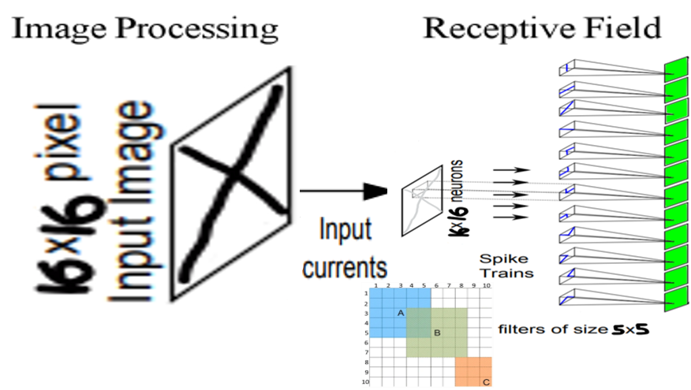

# SNN based on lif model in erlang
This is an erlang implementation of spiking neural network. Our main traget is to develop a network that can determine between X and O.
In future work, we want to use Spike-Time Dependent Plasticity (STDP) algorithm in order to train our model to identify more items.

In this branch we will present a full distributed SNN that works with two computers:
 - One computer would be the input layer of the SNN
 - Second computer would be the output layer of the SNN
 
 Note: in our main project there is a server and graphic interface for the network.
 
## Network Structure
   As said before, we used two computers one for every layer.
   
   In the first layer we have 256 neurons and in the second layer we have 4 neurons.
   
   Our work was based on given weights: https://github.com/Shikhargupta/Spiking-Neural-Network
    
  

## Image Processing
   In order to translate the image into spike train, we used receptive field that helped us to encode the image.
   
   In the folder of [Image processing](Image processing) you can see the relevant python files.
   
   
   
## Results
  After we tested our network we got results that show that we indeed identify between X/O:
   
  